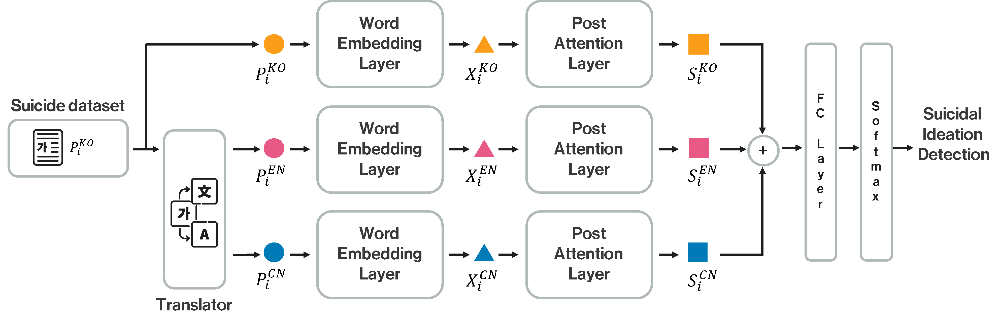

# Cross-Lingual Suicidal-Oriented Word Embedding toward Suicide Prevention
- [Daeun Lee](https://sites.google.com/view/daeun-lee), Soyung Park, [Jiwon Kang](https://ji1kang.github.io/), [Daejin Choi](https://daejin-choi.github.io/), [Jinyoung Han](https://sites.google.com/site/jyhantop/), Cross-Lingual Suicidal-Oriented Word Embedding toward Suicide Prevention, EMNLP findings 2020.
- **[Project page](https://dsail-skku.github.io/Cross-Lingual-Suicidal-Embedding/)**
- Overall Architecture

# Dataset
- Suicide Dictionay
	- Korean Suicide Dictionary (Ours, Download: [Google Drive](https://drive.google.com/drive/folders/188jQDrNM28CLinFYBNiXVLdX5hebdEtf?usp=sharing) )
	- Chinese Suicide Dictionary  [Lv et al. (2015)](https://peerj.com/articles/1455/) 
	-  English Suicide Dictionary  [Gaur et al. (2019)](https://dl.acm.org/doi/pdf/10.1145/3308558.3313698) 
- Suicide-oriented Word embedding (Download: [Google Drive](https://drive.google.com/drive/folders/188jQDrNM28CLinFYBNiXVLdX5hebdEtf?usp=sharing) )
	- word2vec: Korean, Chinese, and English 
	- fasttext: Korean, Chinese, and English 

# Acknowledgments
This research was supported in part by Basic Science Research Program through the National Research Foundation of Korea (NRF) funded by the Ministry of Education (NRF-2018R1D1A1A02085647) and the MSIT (Ministryof Science and ICT), Korea, under the ICAN (ICT Challenge and Advanced Network of HRD) program (2020-0-01816) supervised by the IITP (Institute of Information & Communications Technology Planning & Evaluation).
